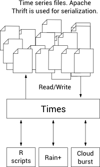

# Times

Times is a network service for storage and retrieval of time series data. For our research many components like [Rain+](https://github.com/jacksonicson/cloudburst), [Cloudburst](https://github.com/jacksonicson/cloudburst), or simple R analysis scripts required access to a certain set of time series data. Each component only required a small number of time series out of a data set of multiple GBytes. Instead of maintaining multiple copies of the data on different servers, Times provides time series as a network service. All our components access Times to load time series data. 

Times is written in Python. Apache Thrift is used to provide a network service which can be accssed by a wide range of different programming languages. Thrift is also used to serialize time series data in a highly efficient binary format on disk. Still, retrieving and storing time series is fast. 

